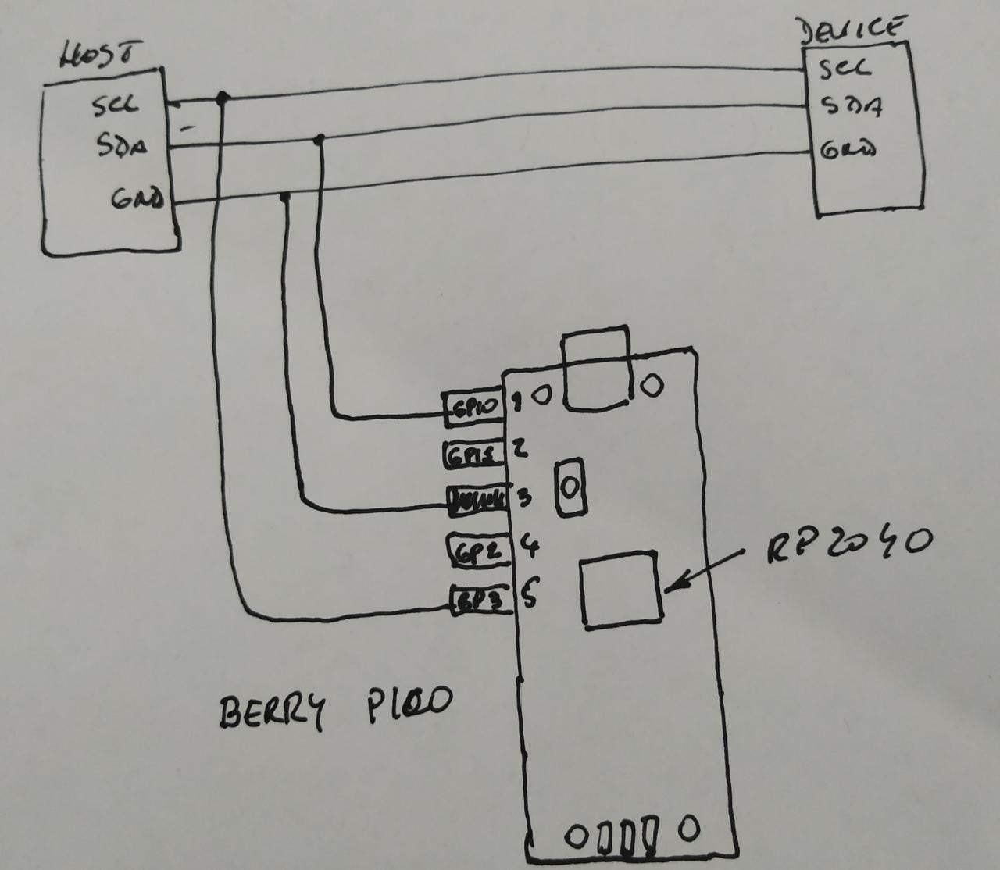
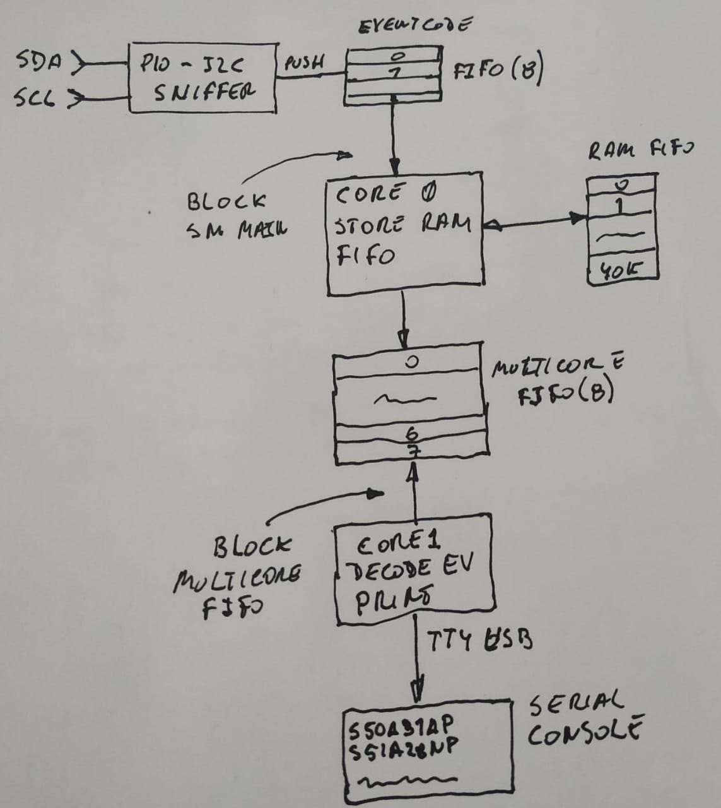
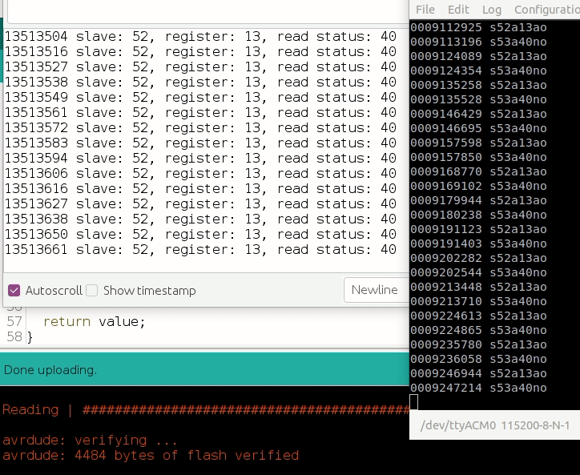

# I2C sniffer - RP2040 - PICO

The purpose of this project is to develop a sniffer for the I2C BUS that can capture at 400 KHZ. 

For 100 Khz, it is possible to use bit-banding (IRQ or Polling) with an 8/32 bit processor, for example an AVR8, but since for 400 Khz it is necessary to react in less than 1.5 uS, a CPLD or FPGA is required. 

An intermediate way is to use the processor [RP2040](https://www.raspberrypi.org/products/raspberry-pi-pico/) that has a PIO unit that  executes instructions in one cycle independent of central CPUs. The operating speed of the PIO can reach 125 Mhz.

## I2C protocol

A simplification of the i2c working principle could be that there are three conditions to detect: START DATA and STOP. And when the clock pin level (SCL) is high, the data pin transitions (SDA) indicate start or stop, but if (SDA) remains stable then it is a valid data bit.


## PIO-based sniffer working principle

Each PIO has 4 state machines that can be programmed to decode a part of the protocol and use an IRQ/WAIT to communicate. 

For example, SM0 executes the program that decodes the START condition and fire IRQ 7 that SM 3 listens, which executes the main program that is waiting for the IRQ to PUSH the event in the transmit FIFO.


Excerpt from the code of the START and MAIN state machine.

```assembly
.program i2c_start
.wrap_target
wait_sda_low:    
    wait 0 gpio SDA_PIN     ; Wait for the sda pin to go down.
    jmp pin detected        ; If the SCL is high, the condition was detected.
    jmp wait_sda_high       ;

detected:
    set pins EV_START       ; Set the event code for START
    irq wait IRQ_EVENT      ; Fire the irq event  

wait_sda_high:
    wait 1 gpio SDA_PIN     ; 
.wrap

.program i2c_main
.wrap_target
wait_irq_event:    
    wait 1 irq IRQ_EVENT    ; Wait for the irq event.
    jmp pin send_event      ; If the lsb of the event code is zero, read the data bit.
    in pins, 1              ; Update the ISR register with the SDA value. 
    jmp wait_irq_event      ; loads it into the FIFO when it reaches 9 bits.

send_event:
    mov isr, pins           ; Load the EV1(3), EV0(1), SDA(0). 
    in NULL, 9              ; The event code starts at bit 11 and ends at 12.
.wrap
```

### Coding of sniffer events

When the main state machine inserts a 32-bit event into the FIFO, it uses the following format: the least significant nines are reserved for the address or data that is made up of 8 bits plus the ack/nack, and the 11th bits and 12 encode the event code.


### Connection diagram

The sniffer connection to the I2C bus is as follows: the SDA line connects to the GPIO, the SCL line to the GPIO3 and the GND is shared.

NOTE: the bus is 3.3V logic.



## Firmware description

Although each state machine has an 8-level fifo, it was decided to take advantage of the fact that the pico has two CPUs, and dedicate CORE0 to wait for the i2c events from the main state machine and communicate them to CORE1 through the multicore fifo of 8 levels; so that it decodes them and sends them through the USB serial port to a console.

To increase the level of FIFOs, one was implemented in RAM (40K events) controlled by CORE0 for buffering when the multicore FIFO is full.



## Ascii event encoding

The ascii output is a succession of events in the sequence in which they were detected by the sniffer. It must be assumed that the slave address is the one immediately after the START event, and that after the 8 bits encoded in ascii the ack / nack bit continues. 
To improve readability, a CR LF is added each time the STOP condition is detected.

`s = START CONDITION`
`p = STOP CONDITION`
`a = ACK DETECTED`
`n = NAK DETECTED`

Below is an excerpt of the command to get range from the VL530X sensor using the [Pololu Arduino library](https://github.com/pololu/vl53l0x-arduino/blob/master/VL53L0X.cpp). 

    Capture         Source Code
    -------         -------------
    s52a13ap    -   readReg(RESULT_INTERRUPT_STATUS)
    s53a40np    -   status = 40
    s52a13ap    -   readReg(RESULT_INTERRUPT_STATUS)
    s53a44np    -   status = 44
    s52a1Eap    -   readReg16Bit(RESULT_RANGE_STATUS + 10);
    s53a08a05np -   range = 0805
    s52a0Ba01ap -   writeReg(SYSTEM_INTERRUPT_CLEAR, 0x01);
    s52a80a01ap -   writeReg(0x80, 0x01);
    s52aFFa01ap -   writeReg(0xFF, 0x01);
    s52a00a00ap -   writeReg(0x00, 0x00);
    s52a91a3Cap -   writeReg(0x91, stop_variable);
    s52a00a01ap -   writeReg(0x00, 0x01);
    s52aFFa00ap -   writeReg(0xFF, 0x00);
    s52a80a00ap -   writeReg(0x80, 0x00);
    s52a00a01ap -   writeReg(SYSRANGE_START, 0x01);
    s52a00ap    -   readReg(SYSRANGE_START)
    s53a00np    -   answer = 00


### Download the firmware in Raspberry Pi Pico

Hold down the BOOTSEL button while plugging the board into USB. The uf2 file [i2c_sniffer_pio.uf2](https://github.com/jjsch-dev/pico_i2c_sniffer/blob/master/bin/i2c_sniffer_pio.uf2) should then be copied to the USB mass storage device that appears. Once programming of the new firmware is complete the device will automatically reset and be ready for use.

### Test scenario 

To test the capture, an arduino nano was used as a master that requests the status of a VL530 TOF every 10 mS on a 400 Khz i2c BUS..


### Preliminary results

The following video shows the arduino monitor consulting the status, and the serial console that sends the result of the sniff of the i2c bus.
Note: Given the nature of the test, it has not been possible to check for loss of frames or data.



### TinyUSB - serial console

To make the usb port behave like a serial port (CDC) pico uses the TinyUSB library, and with the option pico_enable_stdio_usb ($ {PROJECT_NAME} 1) it is integrated into the output console (printf).
For this case, the conversions (% c% x% s) add a lot of delay, so it was decided to do the conversion locally by nibbles.
To further optimize speed, MUTEX and CR and LF conversion were disabled with PUBLIC PICO_STDOUT_MUTEX = 0 PICO_STDIO_ENABLE_CRLF_SUPPORT = 0.

## Print using buffered string

When the output is via USB CDC, the data is sent in packets of maximum 64 bytes every 1mS. As the decoding of the i2c frame is composed of more than one event (Start / Stop / Data) that are separated by a few uS, to optimize the output they are stored in buffer waiting for: STOP, the buffer is full, or that elapsed more than 100 uS since the last event.

### Led indicator

The LED is used to indicate that the board has initialized successfully (ON), flashes when there is activity on the i2c bus, and turns off when it detects a RAM overflow.